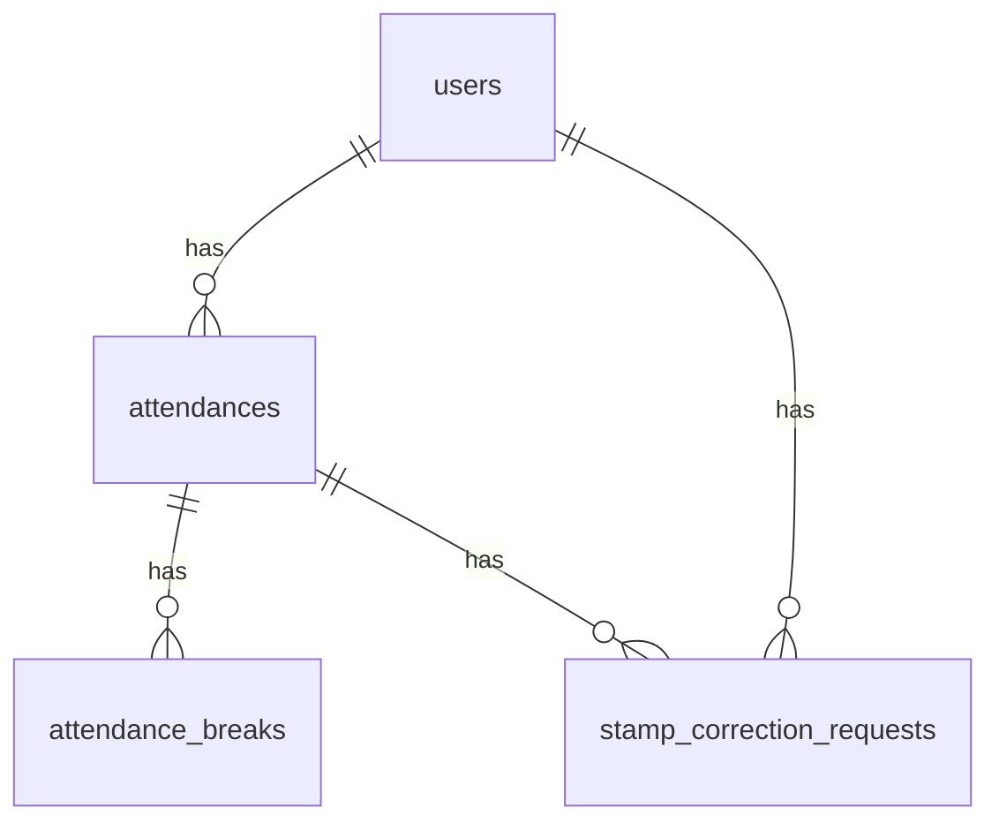

# テーブル仕様（概要）

本ドキュメントはアプリ実装と一致するよう整理したテーブル概要です（10 テーブル以内）。

## ER 図（概念）

## users

| カラム | 型 | 説明 |
|--------|-----|------|
| id | bigint | PK |
| name | string | 氏名 |
| email | string | 一意 |
| email_verified_at | timestamp | メール認証日時 |
| password | string | ハッシュ |
| is_admin | boolean | 管理者フラグ |
| remember_token | string | 任意 |
| created_at / updated_at | timestamp | |

## attendances

| カラム | 型 | 説明 |
|--------|-----|------|
| id | bigint | PK |
| user_id | FK users | |
| work_date | date | 日付（ユーザー×日付で一意） |
| clock_in_at | datetime | 出勤 |
| clock_out_at | datetime | 退勤 |
| status | string | off_duty / working / on_break / completed |
| note | text | 備考 |
| created_at / updated_at | timestamp | |

## attendance_breaks

| カラム | 型 | 説明 |
|--------|-----|------|
| id | bigint | PK |
| attendance_id | FK attendances | |
| break_start_at | datetime | |
| break_end_at | datetime | 休憩中は null |

## stamp_correction_requests

| カラム | 型 | 説明 |
|--------|-----|------|
| id | bigint | PK |
| user_id | FK users | 申請者 |
| attendance_id | FK attendances | 対象勤怠 |
| status | string | pending / approved |
| remark | text | 備考 |
| requested_clock_in_at | datetime | 申請時刻 |
| requested_clock_out_at | datetime | |
| requested_breaks | json | 休憩配列 |
| approved_at | timestamp | 承認日時 |
| created_at / updated_at | timestamp | |

## その他

Laravel 標準の `sessions`, `cache`, `jobs`, `password_reset_tokens` などはフレームワーク用です。
